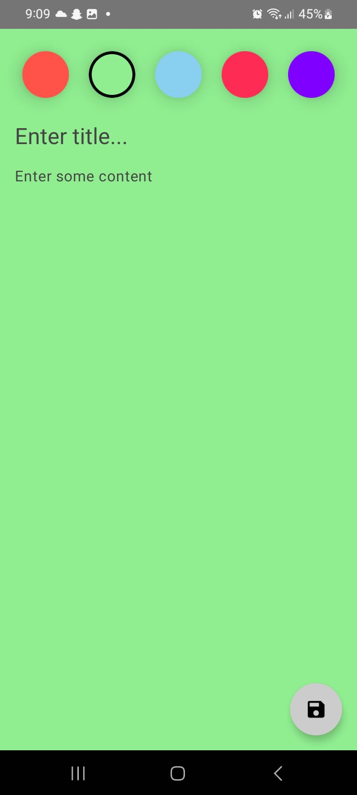
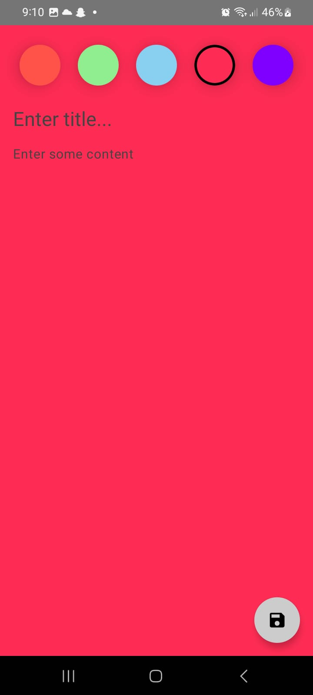
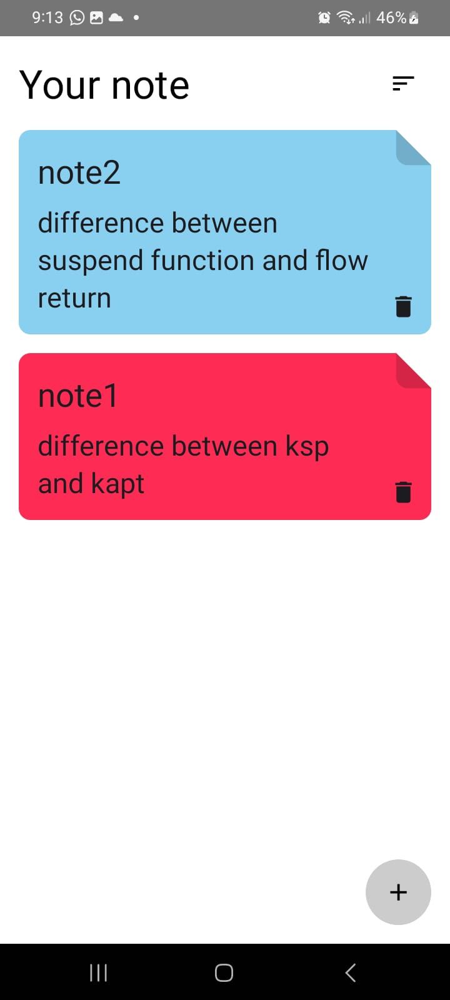
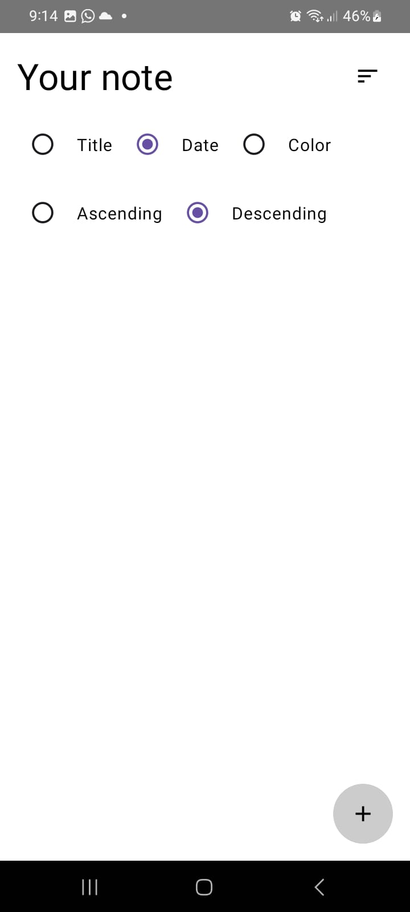
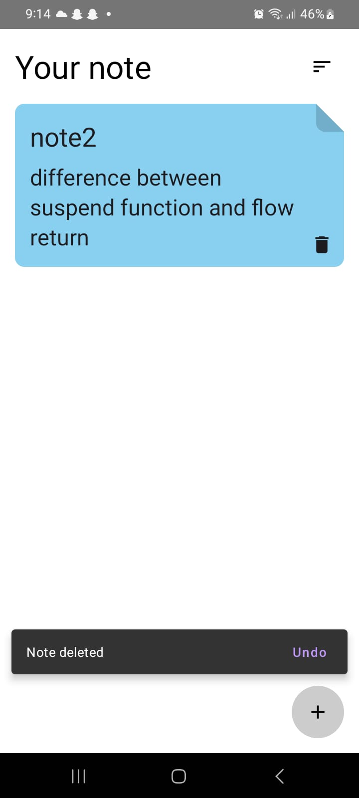

# Compose-Note-App
 
 

# Description
Simple Note App that enable user save notes,edit or delete his/her notes also can list all notes and sort it by title,date or color descending or ascending.

# Features:
1- Show all notes. 
2- Sort notes. 
3- Edit note . 
4- Delete note. 
5- Restor note. 

# Built with:
• Kotlin 
• Jetpack Compose 
• MVVM Clean Architecture 
• Room Database 
• Hilt 
• Coroutines 
• Compose Navigation 

# Screen Shots

